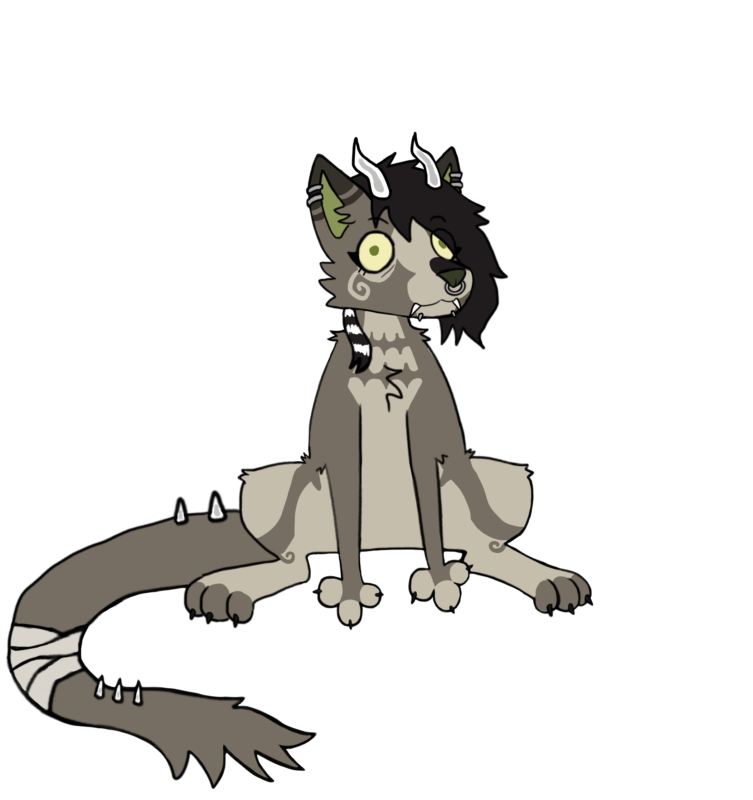

```                                                                                                      
▄████  ▄███▄   █▄▄▄▄   ▄   ██      ▄   ██▄   ██       ██   █      ▄▄▄▄▀ 
█▀   ▀ █▀   ▀  █  ▄▀    █  █ █      █  █  █  █ █      █ █  █   ▀▀▀ █    
█▀▀    ██▄▄    █▀▀▌ ██   █ █▄▄█ ██   █ █   █ █▄▄█     █▄▄█ █       █    
█      █▄   ▄▀ █  █ █ █  █ █  █ █ █  █ █  █  █  █     █  █ ███▄   █     
 █     ▀███▀     █  █  █ █    █ █  █ █ ███▀     █        █     ▀ ▀      
  ▀             ▀   █   ██   █  █   ██         █        █               
                            ▀                 ▀        ▀
```

(ﾉ◕ヮ◕)ﾉ*:･ﾟ✧  

<div id="user-content-toc" align="left">
  <ul style="list-style: none;">
    <summary>
      <h1>⚔️ Hello! My name is {Fernanda}</h1>
    </summary>
  </ul>
</div>
 I’m currently studying Software Development at FIAP, just starting my journey into the programming world. I’m passionate about building creative projects and constantly learning more about technology. <br>
 ─────────────────────── ✦ ─────────────────────── <br>
 
- 📍 Brazil, São Paulo - SP <br>
- ⚡ Curious about web development and building cool websites <br>
- ⚙️ Exploring software development and fun tech projects <br>
- 🎮 Planning to start learning game development and create fun projects <br>
- ⭐ Curiosity: I love making digital art! <br>

 ─────────────────────── ✦ ───────────────────────
<div id="user-content-toc" align="left">
  <ul style="list-style: none;">
    <summary>
      <h2>Languages & Technologies </h2>
    </summary>
  </ul>
</div> 
 
🪽 Currently learning:
        
🔮 Want to learn:
        
🎨 I can also draw and model!
       

## 👾 Statistics
<div align="left">
  <a href="https://github.com/fernandaa-alt"> 
    
    
  </a>
</div>

## ⛓️ Contact

✉️ Email: fernanda.alt2006@gmail.com <br>
🔗 LinkedIn: [Fernanda Alt](https://www.linkedin.com/in/fernanda-alt-a99aa529b) <br>
💚 [My Site - Under Construction]() <br>


```
   ╔═══════════════╗
   ║  THE END...   ║
   ╚═══════════════╝
( 'д')つ Bye
```
